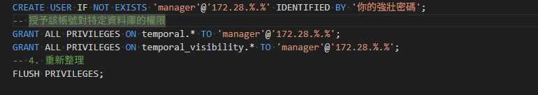
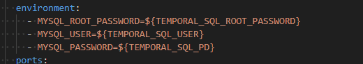

# 安裝
```bash
# 1. 安裝官方 PHP SDK
composer require temporal/sdk

# 2. 安裝 RoadRunner (這是運行 Worker 的高效能引擎)
composer require spiral/roadrunner
```
# 下載roadrunner二進制檔案
```bash
./vendor/bin/rr get-binary 
```

# 根據docker配置在docker裡面寫下mysql的配置檔案

- docker/mysql/init.sql


# 記得填寫env數值


# 在appserviceprovider.php
```php
$this->app->singleton(WorkflowClientInterface::class, function ($app) {
            // 連接到你 Docker 裡的 Server
            $serviceClient = ServiceClient::create(config('temporal.host').':'.config('temporal.port'));
            return WorkflowClient::create($serviceClient);
        });
```
temporal.host 預設為localhost
temporal.port 根據docker配置預設為7233